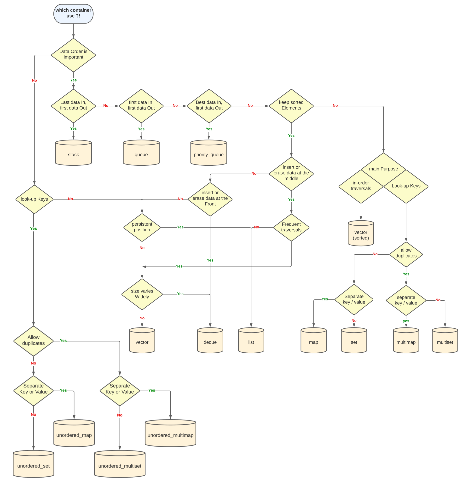
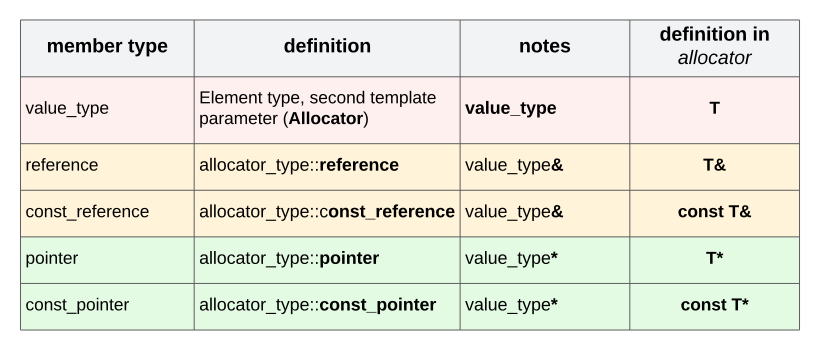
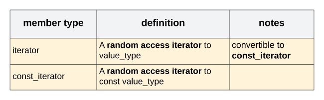
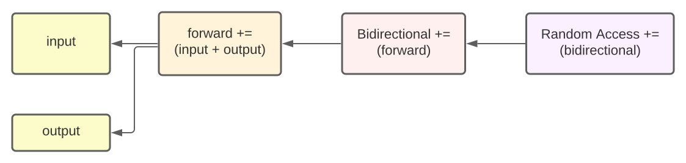
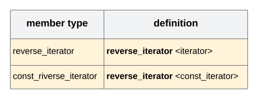

## Skills addressed 

* Language C++ version 98.
* STL library container.

## Introduction


* **this project will implement a few container types of the C++ standard template library.**
* We must Implement **3 different** containers:
  * **Associative container:** `Map`.
  * **Sequence container:** `Vector` (without vector<bool>).
  * **Derived container:** `Stack` (use with vector class).


* We must also implement **7 structures** for our containers.
  * `std::iterator_traits`.
  * `std::reverse_iterator`.
  * `std::enable_if`.
  * `std::is_integral`.
  * `std::equal` **and/or** `std::lexicographical_compare`.
  * `std::pair`.
  * `std::make_pair`.

<p align="center">
  
</p>

## Main concepts

* Containers or container classes **store objects and data**. They are implemented as **class templates**, which allows a 
great flexibility in the types supported as elements. They are part of the 
[**C++ Standard Template Library**](https://github.com/0xCAF3D0OD/CPP/tree/main/module_08)
 
 
* Containers replicate structures very commonly used in programming:
  * **dynamic arrays** (`vector`).
  * queues (queue).
  * **stacks** (`stack`).
  * heaps (priority_queue).
  * linked lists (list).
  * trees (set).
  * **associative arrays** (`map`).


&nbsp;&nbsp;&nbsp;&nbsp;&nbsp;&nbsp;
[]("https://github.com/0xCAF3D0OD/ft_containers/blob/main/img/containers.svg")


* `stack`, **queue** and **priority_queue** are implemented as **container adaptors**. Container adaptors are not full container
  classes, but **classes that provide a specific interface relying on an object of one of the container classes to handle
  the elements**.


* There are **seven standards container classes**, **three container adaptor classes** and **seven header files**
  that provide access to these containers or container adaptors.


&nbsp;&nbsp;&nbsp;&nbsp;&nbsp;&nbsp;
[]("https://github.com/0xCAF3D0OD/ft_containers/blob/main/img/containers_header_file.svg)


<details>
  <summary><b>General view on which container to adopt according to the situation</b></summary>

  []("https://github.com/0xCAF3D0OD/ft_containers/blob/main/img/which_container.svg)
</details>


## Containers

### Vector

* **`Vectors` are sequence containers representing arrays that can change in size.**
* `Vectors` are the same as `dynamic arrays` with the ability to **resize itself automatically when an element is inserted 
or deleted**, with their storage being handled automatically by the container.

#### **[Declaration of Vectors in C++](https://www.mygreatlearning.com/blog/vectors-in-c/)**

* the C++ **definition of std::vector** from <vector> header library file:
  ````c++
    template < class T, class Allocator = std::allocator<T> > class vector;
    ````
* `T` - The type of the **element**, may be **substituted by any other data type** including user-defined type.
* `Allocator` - The Type of **allocator** object. By default, the allocator class template is used. 
Which defines the memory allocation/de-allocation model, construct/destroy elements and is value-independent.

#### **[Member types](https://riptutorial.com/cplusplus/example/14397/member-types-and-aliases)**

* Member Types are **type aliases** contained within, and treated as members of, the class itself.
  * `value_type` - First template parameter - **Represent as** `T`.


  * `std::allocator` - Allocators are **classes that define memory models** to be used by some parts of the Standard Library -
   **Represent as** `allocator`.

  &nbsp;&nbsp;&nbsp;&nbsp;&nbsp;&nbsp;
  []("https://github.com/0xCAF3D0OD/ft_containers/blob/main/img/tableau_alloc.svg)


  * `std::random_access_iterator_tag` - Random-access iterators are **[iterators](https://cplusplus.com/reference/iterator/iterator/)**
  that can be used to **access elements at an arbitrary offset position** relative to the element they point to, 
  **offering the same functionality as pointers**.

  * Empty class to identify the category of an iterator as a random-access iterator.

  &nbsp;&nbsp;&nbsp;&nbsp;&nbsp;&nbsp;
  []("https://github.com/0xCAF3D0OD/ft_containers/blob/main/img/tableau_iterator.svg)
  
  * The properties of each **[iterators category](https://cplusplus.com/reference/iterator/)**

  &nbsp;&nbsp;&nbsp;&nbsp;&nbsp;&nbsp;
  []("https://github.com/0xCAF3D0OD/ft_containers/blob/main/img/hierarchy_iterator.svg)


  * `std::reverse_iterator` - This class **reverses the direction** in which a bidirectional or random-access iterator 
  iterates through a range.

  &nbsp;&nbsp;&nbsp;&nbsp;&nbsp;&nbsp;
  []("https://github.com/0xCAF3D0OD/ft_containers/blob/main/img/tableau_reverse_iterator.svg)
 
 
  * `difference_type` - A **signed integral type**, identical to: `iterator_traits<iterator>::difference_type`.

    **-** The same as `ptrdiff_t`.


  * `size_type` - An **unsigned integral type** that can represent any non-negative value of difference_type.

    **-** The same as `size_t`.